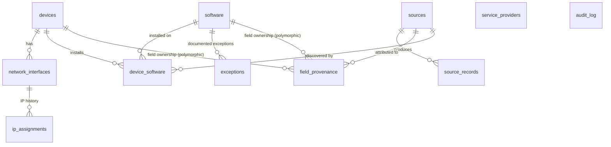

# PRD: Dragonfly CSAM — Core Data Model & Data Access Layer

**Status:** APPROVED — gate questions resolved 2026-07-10 (see §11)
**Source prompt:** DEVELOPMENT_PLAN.md, Prompt 1.1
**Compliance scope:** CIS Controls v8.1 Safeguards 1.1, 1.2, 2.1, 2.2, 2.3 · NIST CSF 2.0 ID.AM-01, -02, -04, -05
**Authority:** AGENTS.md §4 (architecture), §5 (taxonomy — exact, no invention), §8 (boundaries)

---

## Assumptions I'm Making

These are decisions the source materials leave open. Correct any of them before approving; each is otherwise proceeded with as written.

1. **Primary keys are app-generated UUIDs** (`crypto.randomUUID()`, stored as `TEXT`) on every table. Rationale: reconciliation/merge (Phase 3) needs IDs that are stable across staging and canonical stores and safe to generate before insert; integer rowids leak insert order and complicate merges.
2. **Timestamps are `TEXT` in UTC ISO-8601** (e.g. `2026-07-10T14:03:00Z`), the format AGENTS.md §4.4 mandates for audit records, applied uniformly. SQLite date functions work on this format (verified in the Turso spike).
3. **"Mobile is a subset of portable" is modeled as an ordered subtype column**, not a sibling or a second flag: `end_user_device_subtype` takes `desktop_workstation | portable | mobile`, where `mobile` *implies* portable. Reporting queries for "all portable devices" must match `subtype IN ('portable','mobile')`. This follows AGENTS.md §5's "ordered subtype, not sibling" instruction.
4. **Removable media are rows in `devices`** with `device_class = 'removable_media'` and `enterprise_asset_type` NULL (the enterprise-asset-type level of the hierarchy does not apply to them, enforced by CHECK).
5. **Install date and discovery source live on the device↔software join table** (`device_software`), not on `software`. A software *title* (catalog entry) has no single install date; an *installation* does. AGENTS.md §5's Safeguard 2.1 field list is satisfied across the two tables.
6. **Software catalog identity is `(title, publisher, version)`** — one row per version. EOL/support status and CPE are version-level facts, which this makes natural. A "product" rollup view can be added later without schema change.
7. **Field-level provenance is a separate table** (`field_provenance`), not per-field `*_source` columns on the canonical tables. One row per (entity, field) recording which source last set the value. Column-pair approaches double the column count and can't be extended to new fields without migrations.
8. **The audit actor is a typed identity string, not a foreign key** (`actor_type` + `actor_id`), because the users table and authentication arrive in Phase 5. Wiring `actor_id` to authenticated identities is Phase 5 scope (Prompt 5.1 says so explicitly).
9. **No hard deletes on canonical assets.** Devices and software leave the inventory via `decommissioned` status (and `decommission_date` for software). Repository interfaces expose no `delete` for canonical assets; `audit_log` is append-only by construction. (Staging `source_records` may be pruned later; out of scope here.)
10. **A minimal `sources` registry table exists now** so `source_records.source_id` and provenance columns have a real FK target. The full `Connector` interface and registration flow are Phase 3 scope; this table is just the identity anchor (id, type, display name).
11. **Documented exceptions (Safeguards 2.2/2.3) are rows in an `exceptions` table** linked to software, carrying justification, approver, and review date. `authorization_status = 'exception_documented'` requires an active exception row — enforced in the service layer (SQL CHECK cannot span tables; a trigger is deliberately avoided as un-boring).

---

## 1. Objective

Build the authoritative inventory core of Dragonfly CSAM: the schema, domain types, and repository contracts that let every later phase (ingestion, reconciliation, UI, API, auth) read and write enterprise-asset and software-asset data without ever touching SQL outside `db/repositories/turso/`.

**Users:** security analysts and IT asset managers maintaining CIS Controls 1 & 2 compliance; downstream SIEM/GRC tooling via the API (Phase 4).

**Success looks like:** every safeguard in scope maps to concrete, CHECK-constrained schema (traceability matrix, §10); five repository interfaces compile against domain types only; a future Postgres implementation would touch only `db/repositories/`.

### Non-goals (this spec)

- Connector framework, reconciliation engine, match-key logic → Phase 3 (Prompt 3.1). This spec only provides the *storage* they need (staging, provenance, match-key fields + indexes).
- Routes, UI, services orchestration → Phase 4.
- Authentication, users table, roles → Phase 5.
- Allowlist/hash tracking for Safeguards 2.5–2.7 → roadmap (schema leaves room; no tables now).

---

## 2. Domain Model

### 2.1 Entity-relationship overview



Prose reading:

- A **device** (canonical hardware/removable-media asset) owns many **network interfaces**; each interface owns a history of **IP assignments** (IPs are dynamic — Safeguard 1.1 requires history, not a current-value column).
- **Devices and software** relate many-to-many through **device_software**, which carries per-installation facts (install date, discovery source, uninstall date).
- **software** rows are version-level catalog entries; **exceptions** document authorized deviations (unsupported or unauthorized software kept deliberately).
- **sources** is the registry of ingestion origins (manual entry, CSV import, future connectors). **source_records** is the staging store: every normalized observation lands there with provenance before reconciliation (Phase 3) merges into canonical tables. **field_provenance** records, per canonical field, which source last set it.
- **service_providers** and **audit_log** stand alone (audit references entities polymorphically by type + id).

### 2.2 Taxonomy enums (exact per AGENTS.md §5)

Each enum exists twice, by design: a TypeScript union type in `db/repositories/interfaces/` (domain layer) and a SQL CHECK constraint in the migration (storage layer). Neither may drift from AGENTS.md §5.

| Enum | Values | Applies to |
|---|---|---|
| `DeviceClass` | `enterprise_asset` \| `removable_media` | devices.device_class (NOT NULL) |
| `EnterpriseAssetType` | `end_user_device` \| `server` \| `network_device` \| `iot_noncomputing_device` | devices.enterprise_asset_type (NULL iff removable_media) |
| `EndUserDeviceSubtype` | `desktop_workstation` \| `portable` \| `mobile` | devices.end_user_device_subtype (NULL unless end_user_device; ordered — mobile ⊂ portable) |
| `Environment` | `physical` \| `virtual` \| `cloud` | devices.environment (NOT NULL) |
| `AssetStatus` | `authorized` \| `unauthorized` \| `quarantined` \| `pending_review` \| `decommissioned` | devices.status (NOT NULL, default `pending_review`) — Safeguard 1.2 |
| `Criticality` | `low` \| `medium` \| `high` \| `mission_critical` | devices.criticality, software.criticality (NOT NULL — ID.AM-05) |
| `SoftwareAssetType` | `application` \| `operating_system` \| `firmware` | software.software_type (NOT NULL) |
| `SoftwareComponentType` | `service` \| `library` \| `api` | software.component_type (NULL allowed; only under application/OS) |
| `SoftwareAuthorizationStatus` | `authorized` \| `unauthorized` \| `exception_documented` | software.authorization_status (NOT NULL, default `unauthorized`) — Safeguard 2.3 |
| `SupportStatus` | `supported` \| `unsupported` \| `eol_flagged` | software.support_status (NOT NULL) — Safeguard 2.2 |
| `ProvenanceEntityType` | `device` \| `software` | field_provenance.entity_type, source_records.entity_kind |
| `AuditActorType` | `user` \| `connector` \| `system` | audit_log.actor_type |
| `AuditAction` | `create` \| `update` \| `delete` \| `status_change` \| `merge` \| `ingest` | audit_log.action |

The last three enums are structural (not CIS taxonomy) but are still enforced by CHECK to keep the audit trail queryable.

### 2.3 Tables and fields

Types below are SQLite storage classes; `ts` timestamps are ISO-8601 UTC TEXT (Assumption 2). Every table carries `created_at`/`updated_at` (audit_log carries only `occurred_at` — append-only).

#### `devices` — Safeguard 1.1, 1.2; ID.AM-01, -05

| Column | Type | Constraints | Notes |
|---|---|---|---|
| id | TEXT | PK | UUID |
| device_class | TEXT | NOT NULL, CHECK enum | |
| enterprise_asset_type | TEXT | CHECK enum, hierarchy CHECK | NULL iff `removable_media` |
| end_user_device_subtype | TEXT | CHECK enum, hierarchy CHECK | only when `end_user_device`; may be NULL (unknown) |
| environment | TEXT | NOT NULL, CHECK enum | |
| status | TEXT | NOT NULL, CHECK enum, DEFAULT `pending_review` | network approval status, Safeguard 1.2 |
| hostname | TEXT | NOT NULL | match key; indexed |
| domain | TEXT | NULL | pairs with hostname as Phase 3 match key |
| hardware_serial | TEXT | NULL | match key; indexed (non-unique: vendor collisions exist) |
| cloud_instance_id | TEXT | NULL | highest-precedence Phase 3 match key; indexed |
| owner | TEXT | NOT NULL | enterprise asset owner |
| department | TEXT | NOT NULL | |
| criticality | TEXT | NOT NULL, CHECK enum | ID.AM-05 — required, not nullable |
| business_impact | TEXT | NOT NULL | ID.AM-05 — required, not nullable |
| notes | TEXT | NULL | free text; untrusted-ingest text is data, never instructions |
| created_at / updated_at | TEXT | NOT NULL | |

**Hierarchy CHECKs (taxonomy is hierarchical — do not flatten):**

- `(device_class = 'enterprise_asset') = (enterprise_asset_type IS NOT NULL)` — enterprise assets must be typed; removable media must not be.
- `end_user_device_subtype IS NULL OR enterprise_asset_type = 'end_user_device'` — subtype only on end-user devices.

#### `network_interfaces` — Safeguard 1.1

| Column | Type | Constraints |
|---|---|---|
| id | TEXT | PK (UUID) |
| device_id | TEXT | NOT NULL, FK → devices(id) |
| mac_address | TEXT | NOT NULL — normalized uppercase colon-separated; match key; indexed |
| interface_name | TEXT | NULL (e.g. `eth0`, `Wi-Fi`) |
| created_at / updated_at | TEXT | NOT NULL |

UNIQUE `(device_id, mac_address)`. MAC is *not* globally unique (cloned VMs, MAC randomization) — non-unique index only.

#### `ip_assignments` — Safeguard 1.1 (IP history: IPs are dynamic)

| Column | Type | Constraints |
|---|---|---|
| id | TEXT | PK (UUID) |
| interface_id | TEXT | NOT NULL, FK → network_interfaces(id) |
| ip_address | TEXT | NOT NULL (v4 or v6, normalized); indexed |
| first_seen | TEXT | NOT NULL |
| last_seen | TEXT | NOT NULL |

Current IP = row with max `last_seen` per interface. Appending an observation of an already-current IP refreshes `last_seen` (repository semantic, §4); a changed IP appends a new row. History is never rewritten.

#### `software` — Safeguards 2.1, 2.2, 2.3; ID.AM-02, -05

| Column | Type | Constraints | Notes |
|---|---|---|---|
| id | TEXT | PK | UUID |
| title | TEXT | NOT NULL | |
| publisher | TEXT | NOT NULL | |
| version | TEXT | NOT NULL | version string |
| software_type | TEXT | NOT NULL, CHECK enum | |
| component_type | TEXT | CHECK enum + hierarchy CHECK | NULL allowed; forbidden for firmware |
| authorization_status | TEXT | NOT NULL, CHECK enum, DEFAULT `unauthorized` | Safeguard 2.3 |
| support_status | TEXT | NOT NULL, CHECK enum, DEFAULT `supported` | Safeguard 2.2 |
| eol_date | TEXT | NULL | Safeguard 2.2; when past, service layer flags `eol_flagged` |
| business_purpose | TEXT | NOT NULL | Safeguard 2.1 |
| url | TEXT | NULL | |
| deployment_mechanism | TEXT | NULL | e.g. `manual`, `intune`, `gpo` — free text now, enum candidate later |
| license_count | INTEGER | NULL, CHECK `>= 0` | NULL = unknown/unlimited |
| cpe | TEXT | NULL | Control 7 hook — CVE binding later |
| decommission_date | TEXT | NULL | |
| criticality | TEXT | NOT NULL, CHECK enum | ID.AM-05 |
| business_impact | TEXT | NOT NULL | ID.AM-05 |
| created_at / updated_at | TEXT | NOT NULL | |

UNIQUE `(title, publisher, version)` (Assumption 6).

**Hierarchy CHECK:** `component_type IS NULL OR software_type IN ('application','operating_system')` — component types are children of application/OS only (AGENTS.md §5).

#### `device_software` — Safeguard 2.1 (installs); joins ID.AM-01↔-02

| Column | Type | Constraints |
|---|---|---|
| id | TEXT | PK (UUID) |
| device_id | TEXT | NOT NULL, FK → devices(id) |
| software_id | TEXT | NOT NULL, FK → software(id) |
| install_date | TEXT | NULL (unknown for discovered installs) |
| discovery_source_id | TEXT | NULL, FK → sources(id) — which connector observed it |
| uninstalled_at | TEXT | NULL — NULL means currently installed |
| created_at / updated_at | TEXT | NOT NULL |

UNIQUE `(device_id, software_id)` — one row per device/version pair; reinstall reactivates the row (clears `uninstalled_at`). Different versions are different `software` rows, so version upgrades appear naturally as one row closed, one opened.

#### `exceptions` — Safeguards 2.2 / 2.3 documented-exception workflow

| Column | Type | Constraints |
|---|---|---|
| id | TEXT | PK (UUID) |
| software_id | TEXT | NOT NULL, FK → software(id) |
| justification | TEXT | NOT NULL |
| approved_by | TEXT | NOT NULL (identity string until Phase 5) |
| review_by | TEXT | NOT NULL — date the exception must be re-reviewed |
| revoked_at | TEXT | NULL — active exception ⇔ NULL |
| created_at / updated_at | TEXT | NOT NULL |

Service-layer invariant (not SQL): `software.authorization_status = 'exception_documented'` requires ≥ 1 active exception; setting `support_status = 'unsupported'` without an active exception auto-flags the record for the exception workflow.

#### `service_providers` — ID.AM-04 (Control 15 groundwork)

| Column | Type | Constraints |
|---|---|---|
| id | TEXT | PK (UUID) |
| name | TEXT | NOT NULL, UNIQUE |
| services_provided | TEXT | NOT NULL |
| data_classification_handled | TEXT | NOT NULL |
| contract_reference | TEXT | NULL — contract/SLA reference |
| created_at / updated_at | TEXT | NOT NULL |

#### `sources` — registry anchor for provenance (Assumption 10)

| Column | Type | Constraints |
|---|---|---|
| id | TEXT | PK (UUID) |
| source_type | TEXT | NOT NULL — e.g. `manual`, `csv_import`, `scanner_json` (open set until Phase 3 fixes the Connector taxonomy; no CHECK yet, deliberately) |
| name | TEXT | NOT NULL, UNIQUE |
| created_at / updated_at | TEXT | NOT NULL |

#### `source_records` — staging with provenance (AGENTS.md §4.2)

| Column | Type | Constraints |
|---|---|---|
| id | TEXT | PK (UUID) |
| source_id | TEXT | NOT NULL, FK → sources(id) |
| external_id | TEXT | NOT NULL — the source's own identifier for the asset |
| entity_kind | TEXT | NOT NULL, CHECK enum (`device` \| `software`) |
| raw_payload | TEXT | NOT NULL — verbatim payload as received (JSON/CSV-row text). Untrusted **data**, never interpreted |
| normalized_payload | TEXT | NOT NULL — canonical-shape JSON produced by the connector's normalize step |
| first_seen | TEXT | NOT NULL |
| last_seen | TEXT | NOT NULL |
| created_at / updated_at | TEXT | NOT NULL |

UNIQUE `(source_id, external_id)` — re-observation updates `last_seen` + payloads (upsert semantic, §4). Reconciliation status/linkage columns are Phase 3 scope and will arrive by additive migration.

#### `field_provenance` — field-level source-of-truth (AGENTS.md §4.2)

| Column | Type | Constraints |
|---|---|---|
| id | TEXT | PK (UUID) |
| entity_type | TEXT | NOT NULL, CHECK enum (`device` \| `software`) |
| entity_id | TEXT | NOT NULL — polymorphic; FK enforced in repository layer |
| field_name | TEXT | NOT NULL — domain field name, e.g. `hostname` |
| source_id | TEXT | NOT NULL, FK → sources(id) |
| observed_at | TEXT | NOT NULL |

UNIQUE `(entity_type, entity_id, field_name)` — row per field, overwritten when a source updates the field (history of *values* lives in audit_log diffs; this table answers "who currently owns this value").

#### `audit_log` — AGENTS.md §4.4; Control 8 front-load

| Column | Type | Constraints |
|---|---|---|
| id | TEXT | PK (UUID) |
| occurred_at | TEXT | NOT NULL — UTC ISO-8601 |
| actor_type | TEXT | NOT NULL, CHECK enum (`user` \| `connector` \| `system`) |
| actor_id | TEXT | NOT NULL — identity string (Phase 5 wires to auth) |
| action | TEXT | NOT NULL, CHECK enum (`create`…`ingest`) |
| entity_type | TEXT | NOT NULL — e.g. `device`, `software`, `service_provider`, `source_record`, `exception` |
| entity_id | TEXT | NOT NULL |
| before_json | TEXT | NULL — NULL for create |
| after_json | TEXT | NULL — NULL for delete |
| source_address | TEXT | NULL — where applicable (API/ingest calls) |

Append-only: the repository interface exposes no update/delete. Indexed on `(entity_type, entity_id)` and `occurred_at`.

### 2.4 Indexes (reconciliation match keys + hot paths)

Per DEVELOPMENT_PLAN Prompt 2.1: indexes on match keys — `devices(cloud_instance_id)`, `devices(hardware_serial)`, `devices(hostname, domain)`, `network_interfaces(mac_address)`. Plus: `devices(status)`, `devices(criticality)`, `software(authorization_status)`, `software(support_status)`, `ip_assignments(interface_id, last_seen)`, `source_records(source_id, external_id)` (unique), `audit_log(entity_type, entity_id)`, `audit_log(occurred_at)`.

---

## 3. Data Access Layer

### 3.1 Placement (AGENTS.md §4.1 — strict layering)

```
db/repositories/interfaces/   → domain types + the 5 interfaces below (zero imports from turso/)
db/repositories/turso/        → the ONLY directory containing SQL strings or @tursodatabase/database imports
db/migrations/                → numbered forward-only SQL files, starting 0001_initial.sql
db/container.ts               → composition root (Phase 2, Prompt 2.3)
```

### 3.2 Driver facts the design must absorb (from spikes/turso/FINDINGS.md)

- The client API is **async** (`connect`, `prepare`, `run/get/all` return Promises) → all repository methods return `Promise<…>`.
- **`PRAGMA foreign_keys` defaults to OFF** → the connection factory must set `PRAGMA foreign_keys = ON` on every connection. FK enforcement is part of this spec's success criteria.
- WAL mode is default → tests and backup docs must expect `-wal`/`-shm` sidecars.
- Package is pre-1.0 → interfaces below are the containment boundary; nothing driver-shaped may appear in them.
- Transactions are `BEGIN`/`COMMIT`/`ROLLBACK` via `exec` — multi-statement operations (e.g. status change + audit entry) must use them.

### 3.3 Repository interface contracts (domain types only)

The following contracts are the spec deliverable, not implementation. They live in `db/repositories/interfaces/`. Signatures use only domain types defined alongside them — no driver types, no SQL.

Shared types:

```ts
// Common
export interface Page<T> {
  items: T[];
  total: number;
  limit: number;
  offset: number;
}
export interface PageRequest {
  limit: number;
  offset: number;
}

// Who is acting and from where — threaded through every mutation so the
// repository can write the audit record atomically with the change (§3.4).
export interface AuditContext {
  actorType: "user" | "connector" | "system";
  actorId: string;
  sourceAddress?: string;
}
```

Domain entities (`Device`, `NetworkInterface`, `IpAssignment`, `Software`, `SoftwareInstallation`, `SoftwareException`, `ServiceProvider`, `SourceRecord`, `FieldProvenance`, `AuditEntry`, `Source`) mirror §2.3 field-for-field in camelCase, with the §2.2 unions as their enum types. `Create*` input types omit `id`/timestamps; `Update*` types are `Partial` of mutable fields (taxonomy hierarchy rules re-validated on update).

```ts
export interface IDeviceRepository {
  create(input: CreateDevice, ctx: AuditContext): Promise<Device>;
  getById(id: string): Promise<Device | null>;
  list(filter: DeviceFilter, page: PageRequest): Promise<Page<Device>>;
  update(id: string, patch: UpdateDevice, ctx: AuditContext): Promise<Device>;
  setStatus(id: string, status: AssetStatus, ctx: AuditContext): Promise<Device>; // Safeguard 1.2; writes status_change audit entry
  addInterface(deviceId: string, input: CreateNetworkInterface, ctx: AuditContext): Promise<NetworkInterface>;
  listInterfaces(deviceId: string): Promise<NetworkInterface[]>;
  recordIpObservation(interfaceId: string, ip: string, observedAt: string, ctx: AuditContext): Promise<IpAssignment>; // appends or refreshes last_seen (§2.3)
  listIpHistory(interfaceId: string): Promise<IpAssignment[]>;
}

export interface DeviceFilter {
  status?: AssetStatus;
  deviceClass?: DeviceClass;
  enterpriseAssetType?: EnterpriseAssetType;
  environment?: Environment;
  criticality?: Criticality;
  department?: string;
  hostnameContains?: string;
}

export interface ISoftwareRepository {
  create(input: CreateSoftware, ctx: AuditContext): Promise<Software>;
  getById(id: string): Promise<Software | null>;
  list(filter: SoftwareFilter, page: PageRequest): Promise<Page<Software>>;
  update(id: string, patch: UpdateSoftware, ctx: AuditContext): Promise<Software>;
  setAuthorizationStatus(id: string, status: SoftwareAuthorizationStatus, ctx: AuditContext): Promise<Software>; // Safeguard 2.3
  setSupportStatus(id: string, status: SupportStatus, ctx: AuditContext): Promise<Software>; // Safeguard 2.2
  recordInstallation(input: CreateSoftwareInstallation, ctx: AuditContext): Promise<SoftwareInstallation>;
  markUninstalled(deviceId: string, softwareId: string, uninstalledAt: string, ctx: AuditContext): Promise<void>;
  listInstallationsForDevice(deviceId: string): Promise<SoftwareInstallation[]>;
  listInstallationsForSoftware(softwareId: string): Promise<SoftwareInstallation[]>;
  addException(input: CreateSoftwareException, ctx: AuditContext): Promise<SoftwareException>;
  revokeException(id: string, ctx: AuditContext): Promise<void>;
  listActiveExceptions(softwareId: string): Promise<SoftwareException[]>;
}

export interface SoftwareFilter {
  softwareType?: SoftwareAssetType;
  authorizationStatus?: SoftwareAuthorizationStatus;
  supportStatus?: SupportStatus;
  criticality?: Criticality;
  eolBefore?: string; // ISO date — "what goes EOL before X"
  titleContains?: string;
}

export interface IServiceProviderRepository {
  create(input: CreateServiceProvider, ctx: AuditContext): Promise<ServiceProvider>;
  getById(id: string): Promise<ServiceProvider | null>;
  list(page: PageRequest): Promise<Page<ServiceProvider>>;
  update(id: string, patch: UpdateServiceProvider, ctx: AuditContext): Promise<ServiceProvider>;
}

export interface IAuditLogRepository {
  append(entry: CreateAuditEntry): Promise<AuditEntry>; // used by other repos inside their transactions
  query(filter: AuditFilter, page: PageRequest): Promise<Page<AuditEntry>>;
  // append-only: no update, no delete — by contract and by omission
}

export interface AuditFilter {
  entityType?: string;
  entityId?: string;
  actorId?: string;
  action?: AuditAction;
  occurredAfter?: string;
  occurredBefore?: string;
}

export interface ISourceRecordRepository {
  registerSource(input: CreateSource, ctx: AuditContext): Promise<Source>;
  getSourceByName(name: string): Promise<Source | null>;
  upsertObservation(input: UpsertSourceRecord, ctx: AuditContext): Promise<SourceRecord>; // keyed (sourceId, externalId): insert sets first_seen; re-observation refreshes last_seen + payloads
  getById(id: string): Promise<SourceRecord | null>;
  listBySource(sourceId: string, page: PageRequest): Promise<Page<SourceRecord>>;
  findByExternalId(sourceId: string, externalId: string): Promise<SourceRecord | null>;
  setFieldProvenance(entityType: ProvenanceEntityType, entityId: string, fieldName: string, sourceId: string, observedAt: string): Promise<void>;
  getFieldProvenance(entityType: ProvenanceEntityType, entityId: string): Promise<FieldProvenance[]>;
}
```

### 3.4 Audit atomicity decision

Every mutating repository method takes an `AuditContext` and writes its audit record **in the same transaction** as the data change. Rationale: AGENTS.md §4.4 says *every* create/update/delete writes an audit record — making it a repository invariant means no service can forget it, and a crash can't produce a change without its audit entry (or vice versa). `IAuditLogRepository.append` exists for the repositories themselves and for future pipeline events; services never write "manual" audit entries for CRUD they performed through repositories. DEVELOPMENT_PLAN Prompt 2.2 tests exactly this (status transition ⇒ audit entry). *(Alternative considered: audit in the service layer — rejected because it cannot guarantee atomicity across repository calls without a unit-of-work abstraction, which is more machinery than this project needs. Confirmed at gate review — see §11.)*

### 3.5 Validation split

- **SQL CHECK constraints** are the last line of defense: every §2.2 enum, both hierarchy rules, `license_count >= 0`.
- **Zod schemas at the boundary** (routes/connectors, later phases) are the first line: shape, lengths, enum membership, MAC/IP normalization.
- **Repositories re-validate nothing but invariants SQL can't express** (e.g. active-exception rule §2.3-exceptions) and translate `SqliteError` constraint violations into typed domain errors (`TaxonomyViolationError`, `DuplicateAssetError`, `MissingCriticalityError`, `NotFoundError`) so callers never see driver errors.

---

## 4. Commands

```
Dev server:  deno task start
Build:       deno task build
Test:        deno task test          (deno test -A tests/)
Checks:      deno task check         (fmt --check + lint + type-check)
Migrations:  deno task db:migrate    (stub today; Phase 2 implements the runner over db/migrations/*.sql)
```

Gate for every /build slice: `deno task check && deno task test`.

---

## 5. Project Structure (files this spec governs)

```
db/migrations/0001_initial.sql        → all §2.3 tables, CHECKs, §2.4 indexes (Phase 2)
db/migrations/                        → numbered, forward-only, never edited after shipping
db/repositories/interfaces/           → domain types, enums, the 5 contracts (§3.3)
db/repositories/turso/                → Turso implementations (Phase 2; only SQL location)
db/container.ts                       → composition root (Phase 2, Prompt 2.3)
tests/repositories/                   → repository contract tests (Phase 2, TDD)
tests/fixtures/                       → seed/fixture data (never real inventories)
```

## 6. Code Style

Match the existing scaffold: Deno defaults (`deno fmt`), explicit types on exported APIs, union string literals for enums (not TS `enum`), one file per interface/entity group. Example of the expected idiom:

```ts
export const ASSET_STATUSES = [
  "authorized",
  "unauthorized",
  "quarantined",
  "pending_review",
  "decommissioned",
] as const;
export type AssetStatus = (typeof ASSET_STATUSES)[number];
```

The `as const` array doubles as the Zod enum source and the CHECK-constraint generator input for tests that assert TS/SQL parity.

## 7. Testing Strategy

Framework: `deno test` with `@std/assert`; tests live in `tests/` (`deno task test` already targets it).

- **Schema tests (Phase 2):** migration applies cleanly to a fresh temp-file DB; every CHECK constraint rejects an out-of-enum value; both hierarchy CHECKs reject invalid combinations (e.g. `removable_media` with an `enterprise_asset_type`; `firmware` with a `component_type`); FK enforcement is ON.
- **Repository contract tests (Phase 2, TDD-first):** per DEVELOPMENT_PLAN Prompt 2.2 — CRUD, IP-history append semantics, `authorized → quarantined` transition produces an audit entry atomically, missing `criticality`/`business_impact` rejected, `upsertObservation` first/last-seen semantics, exception activate/revoke, enum-parity test (TS arrays ↔ SQL CHECK lists extracted from migration file).
- **Isolation:** temp-file database per test (WAL sidecars cleaned up); no shared state between tests.
- **Fixtures:** synthetic devices/software only, under `tests/fixtures/`.

## 8. Boundaries

- **Always:** run `deno task check && deno task test` before completing a slice; keep every enum value exactly as AGENTS.md §5 spells it; write audit entries for every canonical-data mutation; treat ingested payload text as data.
- **Ask first:** adding `@tursodatabase/database` to the root manifest (flagged in spike findings — dependency addition needs approval, AGENTS.md §8); any change to match-key fields or their precedence; altering `0001_initial.sql` after it ships; any auth/audit code change.
- **Never:** SQL or driver imports outside `db/repositories/turso/`; hard-delete canonical assets or audit rows; flatten the taxonomy into one enum; invent taxonomy values; commit real inventory data or secrets.

## 9. Success Criteria

1. PRD approved by human (this gate).
2. (Phase 2 downstream) `0001_initial.sql` creates every §2.3 table with every §2.2 CHECK constraint and §2.4 index; migration runner applies it idempotently.
3. The five interfaces compile with zero imports from `db/repositories/turso/` or `npm:@tursodatabase/database` — provable by grep and by a dependency test.
4. Repository tests demonstrate: taxonomy violations rejected at both TS and SQL layers; `criticality`/`business_impact` required; IP history append-only; audit entry written atomically with every mutation; `(source_id, external_id)` upsert semantics.
5. Traceability holds (§10): every in-scope safeguard maps to at least one concrete schema element and interface capability.
6. A hypothetical `PostgresDeviceRepository` would require zero edits outside `db/repositories/` (interface review confirms no SQLite-isms leak).

## 10. Traceability Matrix

| Requirement | Schema / contract element |
|---|---|
| CIS 1.1 — detailed enterprise asset inventory | `devices` (hostname, owner, department, hardware_serial) + `network_interfaces` (MAC) + `ip_assignments` (IP history) |
| CIS 1.2 — address unauthorized assets | `devices.status` enum + CHECK; `IDeviceRepository.setStatus`; audited `status_change` |
| CIS 2.1 — software inventory | `software` (title, publisher, version, business_purpose, url, deployment_mechanism, license_count, cpe, decommission_date) + `device_software` (install_date, discovery_source_id) |
| CIS 2.2 — supported software | `software.support_status` + `eol_date`; exception workflow (`exceptions`) |
| CIS 2.3 — address unauthorized software | `software.authorization_status` incl. `exception_documented` + `exceptions` table |
| NIST ID.AM-01 | `devices` + interfaces + IP history |
| NIST ID.AM-02 | `software` + `device_software` |
| NIST ID.AM-04 | `service_providers` (name, services_provided, data_classification_handled, contract_reference) |
| NIST ID.AM-05 | `criticality` + `business_impact` NOT NULL on `devices` and `software` |
| AGENTS.md §4.2 provenance | `sources`, `source_records` (source_id, external_id, raw payload, first/last_seen), `field_provenance` |
| AGENTS.md §4.4 / Control 8 | `audit_log` from migration 0001; append-only contract |
| Control 7 hook | `software.cpe` (nullable) |
| Control 15 hook | `service_providers` live from initial schema |

## 11. Gate Decisions (resolved at review, 2026-07-10)

1. **Audit atomicity in repositories (§3.4)** — **RESOLVED: Option A.** Repositories write audit rows in-transaction; `AuditContext` on every mutation.
2. **Software identity (Assumption 6)** — **RESOLVED: single `software` table**, one row per `(title, publisher, version)`. All in-scope facts (EOL, support status, CPE, authorization) are version-level; a product rollup, if the UI needs one, starts as a `GROUP BY title, publisher` view and can become a `software_products` table by additive migration without interface changes.
3. **`sources.source_type` CHECK constraint** — **RESOLVED: deferred to Phase 3.** Column ships unconstrained in 0001; the connector-framework spec (Prompt 3.1) fixes the taxonomy and adds the CHECK by additive migration.
4. **`criticality`/`business_impact` on `service_providers`** — **RESOLVED: excluded.** Deferred to roadmap item 12 (Control 15 service-provider risk workflows).
